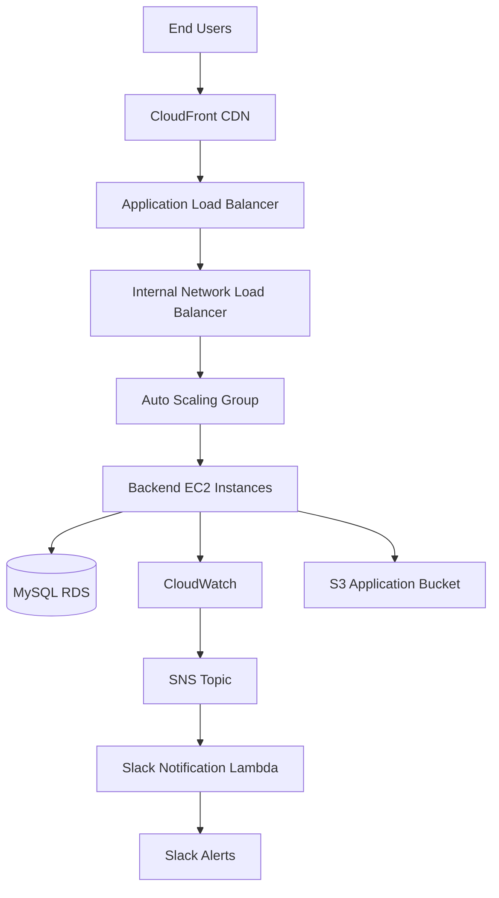
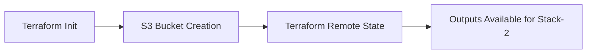
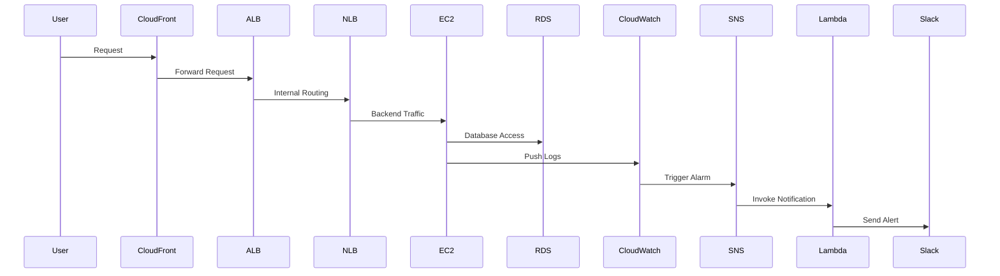
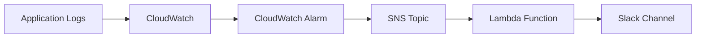

# Cloudnet Infrastructure Platform

## Overview

Cloudnet is an AWS cloud infrastructure platform built using Terraform Infrastructure as Code (IaC). The project provisions a complete production-style cloud environment including networking, compute, databases, load balancing, CDN delivery, monitoring, and automated Slack alerting.

The repository is divided into two independent Terraform stacks:
-----------------------------------------------------------------------------------------------------------------------------------------------
| Stack             | Purpose                                                           |
| ----------------- | ----------------------------------------------------------------- |
| `Harshal-stack-1` | Creates S3 infrastructure and Terraform remote state dependencies |
| `Harshal-stack-2` | Deploys the core AWS infrastructure platform                      |

---

# Architecture Overview



---

# Technology Stack

## Infrastructure & Automation

* Terraform
* AWS Provider
* Terraform Remote State (S3 Backend)
* Modular Terraform Architecture

## AWS Services Used

| Service                         | Purpose                                               |
| ------------------------------- | ----------------------------------------------------- |
| Amazon VPC                      | Isolated networking environment                       |
| Public & Private Subnets        | Segregation of public and internal workloads          |
| Internet Gateway                | Public internet access                                |
| NAT Gateway                     | Secure outbound internet access for private instances |
| EC2 Auto Scaling Group          | Automatically manages backend compute instances       |
| Launch Templates                | Standardized EC2 deployment configuration             |
| Application Load Balancer (ALB) | Handles frontend HTTP traffic                         |
| Network Load Balancer (NLB)     | Internal backend traffic distribution                 |
| Amazon RDS MySQL                | Managed relational database                           |
| Amazon S3                       | Stores application artifacts and Terraform state      |
| CloudFront                      | Global CDN and caching layer                          |
| CloudWatch                      | Monitoring, metrics, and logging                      |
| SNS                             | Notification delivery service                         |
| AWS Lambda                      | Slack notification processing                         |
| Systems Manager Parameter Store | Secure secret management                              |
| IAM Roles & Instance Profiles   | Access control and permissions                        |
| KMS Encryption                  | Encryption for RDS storage                            |

---

# Repository Structure

```bash
cloudnet/
├── Harshal-stack-1/
│   ├── provider.tf
│   ├── main.tf
│   ├── variable.tf
│   ├── env/
│   │   └── terraform.tfvars
│   └── locaclmodul/
│       └── s3/
│
├── Harshal-stack-2/
│   ├── provider.tf
│   ├── variables.tf
│   ├── vpc.tf
│   ├── nlb.tf
│   ├── asg.tf
│   ├── rds.tf
│   ├── cloudfront.tf
│   ├── cloudwatch.tf
│   ├── sns.tf
│   ├── lambda.tf
│   ├── envirolment/
│   │   └── dev/
│   │       └── terraform.tfvars
│   └── localmodules/
│       ├── networking/
│       ├── autoscaling/
│       ├── loadbalancing/
│       ├── storage/
│       ├── caching/
│       ├── monitoring/
│       ├── notification/
│       └── notification-delivery/
│
└── README.md
```

---

# Stack-1: S3 Infrastructure & Remote State

## Purpose

`Harshal-stack-1` creates foundational S3 infrastructure required for:

* Terraform remote state management
* Application artifact storage
* Cross-stack dependency sharing

This stack must be deployed before Stack-2.

---

## Components

### S3 Backend

Used to:

* Store Terraform state remotely
* Enable shared infrastructure state access
* Support collaboration and consistency

### Local S3 Module

Responsible for:

* Creating S3 bucket resources
* Managing reusable Terraform module logic

---

## Stack-1 Deployment Flow



---

# Stack-2: Core AWS Infrastructure

## Purpose

`Harshal-stack-2` provisions the primary cloud infrastructure platform including:

* Networking
* Compute resources
* Database services
* Load balancing
* Monitoring and alerting
* CDN delivery
* Slack integration

---

# Infrastructure Modules

## 1. Networking Module

### Purpose

Creates the secure AWS networking foundation.

### Resources Created

* VPC
* Public Subnets
* Private Subnets
* Internet Gateway
* NAT Gateway
* Route Tables

### Why It Is Used

This layer isolates infrastructure and ensures:

* Secure internal communication
* Public internet access where needed
* Private backend isolation
* Controlled outbound connectivity

---

## 2. Load Balancing Module

### Purpose

Distributes traffic between frontend and backend services.

### Resources Created

* Application Load Balancer (ALB)
* Network Load Balancer (NLB)
* Target Groups

### Why It Is Used

* ALB manages HTTP/HTTPS frontend traffic
* NLB handles high-performance backend TCP traffic
* Improves availability and scalability

---

## 3. Auto Scaling Module

### Purpose

Deploys backend application compute infrastructure.

### Resources Created

* Launch Template
* Auto Scaling Group
* EC2 Instances
* IAM Roles
* Instance Profiles

### Runtime Configuration

Each EC2 instance automatically:

* Installs Java Corretto 11
* Downloads Spring Boot JAR from S3
* Starts backend application
* Connects to MySQL database
* Streams logs to CloudWatch

### Why It Is Used

* Enables automatic scaling
* Supports high availability
* Reduces manual server management

---

## 4. Storage Module

### Purpose

Creates the relational database layer.

### Resources Created

* MySQL RDS Instance
* DB Subnet Group
* Security Groups
* KMS Encryption

### Why It Is Used

* Provides managed relational storage
* Enables secure application persistence
* Removes database administration overhead

### Security Features

* Passwords stored in AWS SSM Parameter Store
* RDS encryption enabled
* Private subnet deployment

---

## 5. Caching & CDN Module

### Purpose

Creates a CloudFront CDN distribution.

### Why It Is Used

* Improves application performance
* Reduces latency
* Enables global content delivery
* Provides caching layer for frontend traffic

---

## 6. Monitoring Module

### Purpose

Implements application monitoring and alerting.

### Resources Created

* CloudWatch Log Groups
* Metric Filters
* CloudWatch Alarms

### Why It Is Used

* Detects backend application errors
* Monitors operational health
* Triggers automated notifications

---

## 7. Notification Module

### Purpose

Creates alert notification infrastructure.

### Resources Created

* SNS Topic
* SNS Subscriptions

### Why It Is Used

* Centralized alert delivery
* Event-driven notification handling

---

## 8. Slack Notification Delivery Module

### Purpose

Sends CloudWatch alerts directly to Slack.

### Resources Created

* Python Lambda Function
* IAM Execution Role
* SNS Trigger Integration

### Why It Is Used

* Real-time operational alerts
* Faster incident response
* Automated monitoring workflow

---

# Infrastructure Workflow



---

# Environment Configuration

## Development Environment

The repository currently includes a `dev` environment configuration.

### Key Configuration

| Configuration          | Value         |
| ---------------------- | ------------- |
| AWS Region             | `us-east-1`   |
| VPC CIDR               | `10.0.0.0/16` |
| Public Subnets         | `3`           |
| Private Subnets        | `3`           |
| Backend Instance Type  | `t2.medium`   |
| Frontend Instance Type | `t2.medium`   |
| Database Engine        | MySQL 8.0     |
| RDS Instance Type      | `db.t3.micro` |

---

# Deployment Order

## Step 1 — Deploy Stack-1

Deploy foundational S3 infrastructure first.

```bash
cd Harshal-stack-1
terraform init
terraform plan -var-file=env/terraform.tfvars
terraform apply -var-file=env/terraform.tfvars
```

---

## Step 2 — Deploy Stack-2

Deploy complete AWS infrastructure platform.

```bash
cd Harshal-stack-2
terraform init
terraform plan -var-file=envirolment/dev/terraform.tfvars
terraform apply -var-file=envirolment/dev/terraform.tfvars
```

---

# Prerequisites

## Required Tools

* Terraform CLI
* AWS CLI
* Git

## Required AWS Permissions

The AWS account must allow:

* VPC
* EC2
* IAM
* RDS
* ELB
* CloudFront
* CloudWatch
* Lambda
* SNS
* SSM
* S3

---

# Security Design

## Security Features Implemented

* IAM role-based access
* Private subnet isolation
* Encrypted RDS storage
* Secrets stored in SSM Parameter Store
* CloudWatch monitoring and alerting
* Controlled inbound security group rules

---

# Monitoring & Alerting

## Monitoring Pipeline



---

# Important Notes

* `Harshal-stack-1` must be deployed before `Harshal-stack-2`
* Replace `slack_web_hook_url` with a valid Slack webhook
* Ensure the backend application JAR exists in S3 before deployment
* The repository currently uses `us-east-1`
* Terraform remote state bucket must exist before initialization
* Stack-2 uses IAM assume-role authentication

---

# Future Improvements

Potential enhancements for the platform:

* Kubernetes (EKS) migration
* GitHub Actions CI/CD automation
* Multi-environment deployment strategy
* Terraform workspaces
* WAF integration
* HTTPS ACM certificate automation
* Blue/Green deployment support
* Centralized observability dashboards
* Cost optimization and autoscaling policies

---

# Summary

Cloudnet provides a modular AWS infrastructure platform using Terraform and AWS managed services. The architecture is designed for scalability, monitoring, secure networking, automated deployment, and operational visibility.

The platform includes:

* Infrastructure as Code
* Secure networking
* Auto-scaled compute
* Managed databases
* CDN acceleration
* Centralized monitoring
* Slack-based operational alerting
* Modular Terraform design
